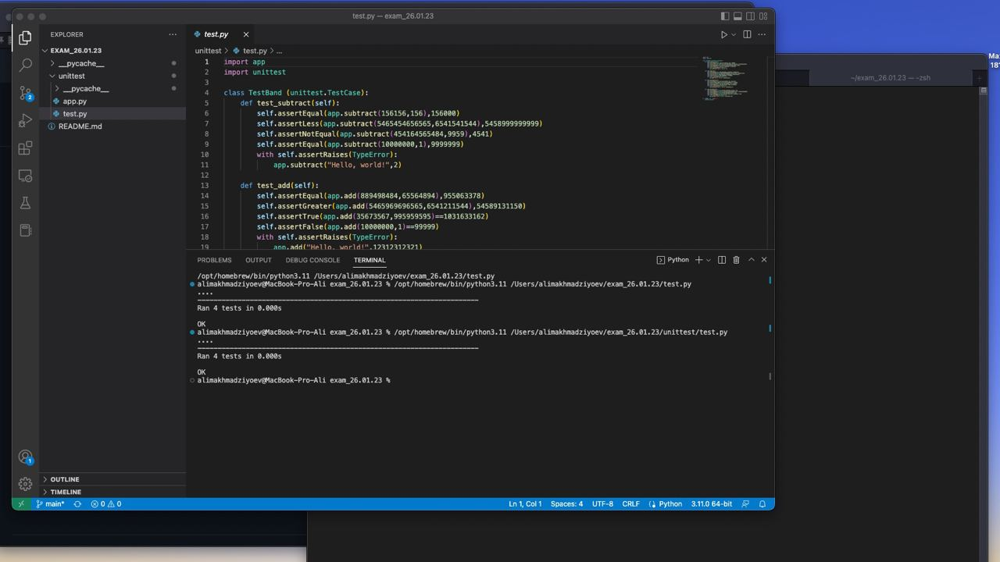

# exam_26.01.23
Экзамен "Разработка и эксплуатация защищенных автоматизированных систем"
## Задание 1 (Модульное тестирование, каталог unittest): дополнительное описание
app.py - файл тестируемого приложения (калькулятор, включающий в себя функции сложения, вычитания, произведения и частного, реализованные отдельными блоками кода)
test.py - файл с алгоритмом проведения модульных тестов
### Использованные сущности
- Модуль unittest
- Класс TestCase - родительский класс (в алгоритме создан свой класс, наследующий его свойства)
- Методы класса TestCase:
  - assertEqual(x,y) - проверка, является ли значение x равным значению y
  - assertNotEqual(x,y) - проверка, является ли значение x не равным значению y
  - assertGreaterEqual(x,y) - проверка, является ли значение x больше значения y или равным значению y
  - assertLessEqual(x,y) - проверка, является ли значение x меньше значения y или равным значению y  
  - assertGreater(x,y) - проверка, является ли значение x больше значения y
  - assertLess(x,y) - проверка, является ли значение x меньше значения y
  - assertTrue(condition) - проверка, выполнено ли условие
  - assertFalse(condition) - проверка, является ли условие невыполненным
  - assertRaises(errortype) - проверка, возникает ли ошибка указанного типа при попытке выполнения фрагмента кода
### Для проведения юнит-тестов
Достаточно выполнить запуск test.py (`python3 test.py`)
### Снимок результата работы алгоритма
#### 
